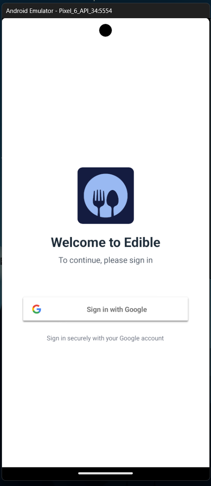
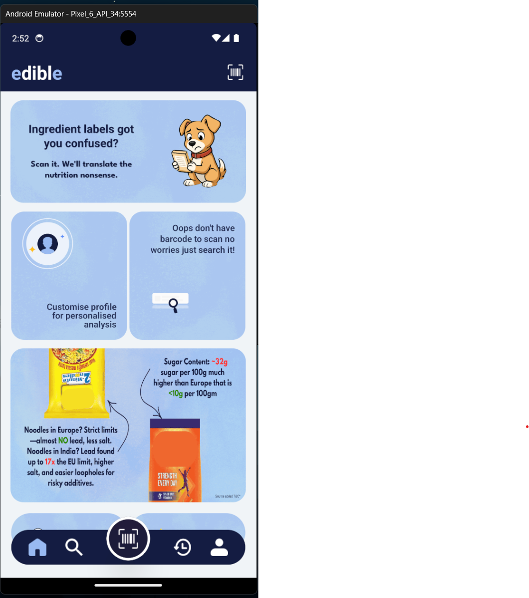
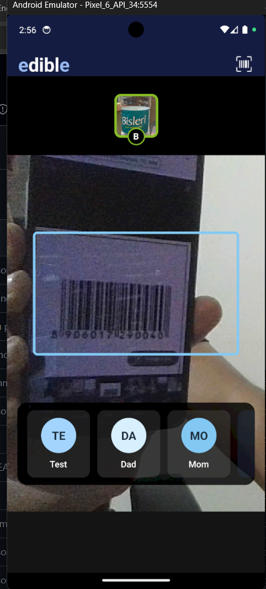
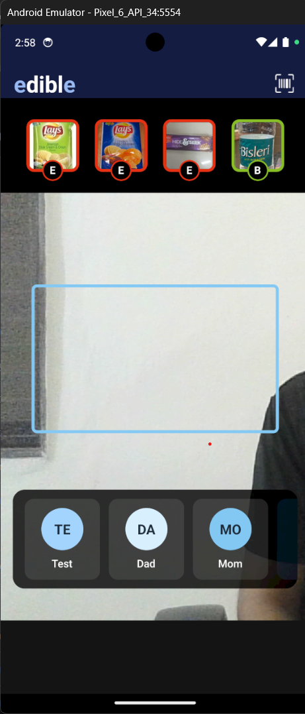
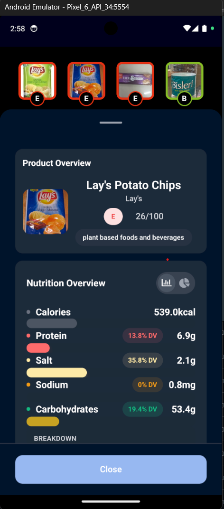
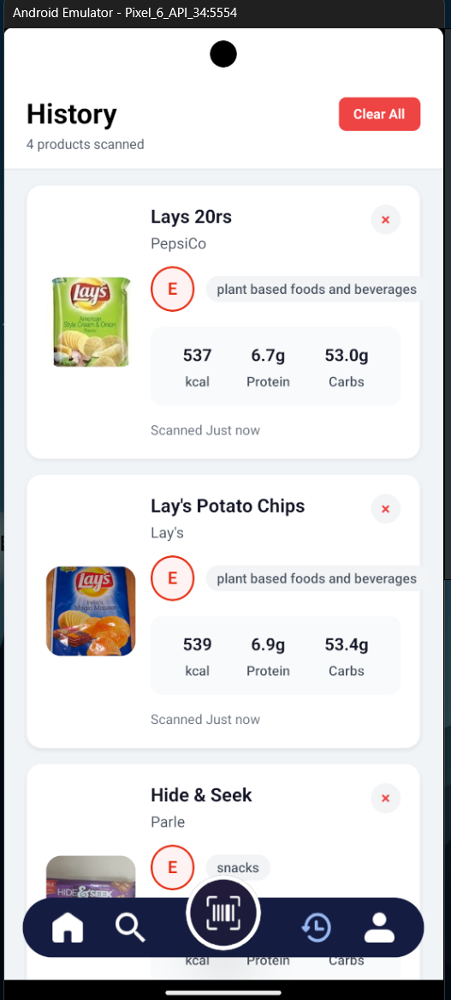
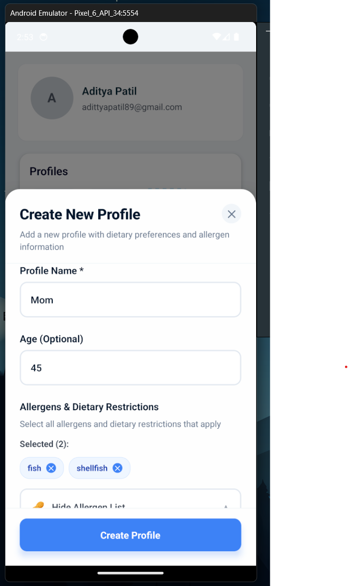
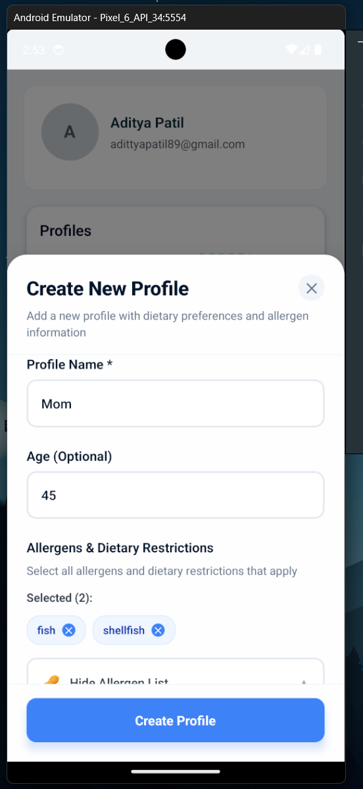

# 🍎 Edible - Food Scanner & Nutrition Tracker

<div align="center">

**Edible** is a mobile app that helps you make informed food choices by scanning product barcodes and providing detailed nutrition information, ingredient analysis, and food quality grades.

[](https://expo.dev/)
[](https://reactnative.dev/)
[](https://www.typescriptlang.org/)

</div>

---

## 📱 What Edible Does

### 🎯 Main Features

<table>
<tr>
<td width="50%">

**🔍 Scan Food Products**
- Point your camera at any food product's barcode to instantly get detailed information
- Supports EAN-13, EAN-8, UPC-A, and UPC-E barcode formats
- Real-time scanning with visual feedback and haptic responses

**📊 Nutrition Information**
- **Nutri-Score Grades**: Get A-E ratings for food products based on nutritional value
- **Detailed Nutrition Facts**: View calories, protein, carbohydrates, and more per 100g
- **Ingredient Analysis**: See complete ingredient lists and decode food additives
- **Allergen Warnings**: Identify potential allergens in products

</td>
<td width="50%">

**📝 Product Tracking**
- Save all your scanned products for easy reference
- View your complete scan history
- Track products across multiple user profiles
- Compare nutrition information between products

**👥 User Profiles**
- Support for multiple user profiles (perfect for families)
- Each profile maintains its own scan history
- Personalized tracking for different users

**🔐 Authentication**
- Secure Google Sign-In authentication
- Persistent login across app sessions
- Secure data storage

</td>
</tr>
</table>

---

## 📸 App Screenshots

<div align="center">

### 🔐 Sign In Screen

<p align="center">
  
</p>
<p align="center"><em>Authenticate with Google to access all app features</em></p>

---

### 🏠 Home Page

<p align="center">
  
</p>
<p align="center"><em>Beautiful home screen with quick access to all features and information</em></p>

---

### 📷 Barcode Scanning

<p align="center">
  
</p>
<p align="center"><em>Point your camera at any product barcode to scan and get instant information</em></p>

---

### 📋 Scanned Products

<p align="center">
  
</p>
<p align="center"><em>View all your scanned products with nutrition grades and key information at a glance</em></p>

---

### ℹ️ Product Information

<p align="center">
  
</p>
<p align="center"><em>Detailed product information including ingredients, nutrition facts, Nutri-Score, and more</em></p>

---

### 📜 Scan History

<p align="center">
  
</p>
<p align="center"><em>Browse through your complete scan history with timestamps</em></p>

---

### 👤 Profile Management

<table>
<tr>
<td align="center" width="50%">


<p><em>Manage your account and view your profile information</em></p>

</td>
<td align="center" width="50%">


<p><em>Profile dashboard with quick access to settings and account management</em></p>

</td>
</tr>
</table>

</div>

---

## 🚀 Get Started

### Prerequisites

- **Node.js** >= 18.0.0
- **npm** >= 8.0.0
- **Expo CLI** (optional, included via npx)

### Installation

1. **Install dependencies**
   ```bash
   npm install
   ```

2. **Install NativeWind** (if not already installed)
   ```bash
   npm install nativewind@4.1.23 tailwindcss@3.4.17 react-native-reanimated@~3.16.1 react-native-safe-area-context@^4.12.0
   ```

3. **Set up environment variables**
   
   Create a `.env` file in the root directory with:
   ```env
   EXPO_PUBLIC_GOOGLE_CLIENT_ID=your_google_client_id_here
   ```

### Running the App

#### Development Mode
```bash
# Start Expo development server
npm start
# or
npx expo start
```

#### Run on Android
```bash
# Generate native code (if needed)
npx expo prebuild

# Run on Android device/emulator
npm run android
# or
npx expo run:android
```

#### Run Android Emulator on Windows
```bash
emulator -avd Pixel_6_API_34
```

#### Run on iOS
```bash
npm run ios
# or
npx expo run:ios
```

#### Run on Web
```bash
npm run web
# or
npx expo start --web
```

### Building for Production

#### Using EAS Build (Recommended)
```bash
# Install EAS CLI (if not installed)
npm install -g eas-cli

# Login to Expo
eas login

# Build for Android
eas build --profile production --platform android

# Build for iOS
eas build --profile production --platform ios
```

**Build Profiles Available:**
- `development` - Development build with dev client
- `preview` - Internal testing build
- `production` - Store-ready build

---

## 🛠️ Tech Stack

| Category | Technology |
|----------|-----------|
| **Framework** | React Native with Expo (~53.0) |
| **Navigation** | Expo Router (file-based routing) |
| **Styling** | NativeWind (Tailwind CSS for React Native) |
| **Authentication** | Google Sign-In via `@react-native-google-signin/google-signin` |
| **Camera** | Expo Camera for barcode scanning |
| **Storage** | Expo Secure Store for sensitive data, AsyncStorage for app data |
| **Backend** | RESTful API integration with Open Food Facts |

---

## 📁 Project Structure

```
Edible-FE/
├── app/                    # App routes (Expo Router)
│   ├── (tabs)/            # Tab navigation screens
│   ├── auth/              # Authentication screens
│   └── scan.tsx           # Barcode scanning screen
├── components/            # Reusable components
├── contexts/              # React contexts (Auth, ScannedProducts)
├── services/              # API services
├── hooks/                 # Custom React hooks
├── utils/                 # Utility functions
├── constants/             # App constants
└── assets/               # Images, fonts, etc.
```

---

## 🔑 Key Features Explained

### 🏆 Nutri-Score Grading

Products are graded A-E based on their nutritional value:

| Grade | Quality | Description |
|-------|---------|-------------|
| **A** | Excellent | Excellent nutritional quality |
| **B** | Good | Good nutritional quality |
| **C** | Average | Average nutritional quality |
| **D** | Poor | Poor nutritional quality |
| **E** | Very Poor | Very poor nutritional quality |

### 🔍 Barcode Scanning

- Supports multiple barcode formats (EAN-13, EAN-8, UPC-A, UPC-E)
- Automatic barcode validation
- Visual scanning frame guide
- Success feedback with haptic responses
- Rate limiting to prevent spam scanning

### 📦 Product Information

Each scanned product includes:
- Product name and brand
- High-resolution product image
- Complete ingredient list
- Nutrition facts (per 100g)
- Nutri-Score grade
- Allergen information
- Product categories
- Scan timestamp

---

## 🔒 Privacy & Security

- 🔐 Google Sign-In authentication
- 🔒 Secure token storage using Expo Secure Store
- 🛡️ No sensitive data stored in plain text
- ✅ All API requests are authenticated

---

## 📝 Available Scripts

| Command | Description |
|---------|-------------|
| `npm start` | Start Expo development server |
| `npm run android` | Run on Android |
| `npm run ios` | Run on iOS |
| `npm run web` | Run on web browser |
| `npm run lint` | Run ESLint |
| `npm run reset-project` | Reset project configuration |

---

## 🤝 Contributing

This is a personal project. For issues or suggestions, please contact the maintainer.

---

## 📄 License

See [LICENSE](./LICENSE) file for details.

---

<div align="center">

**Made with ❤️ to help you make better food choices**

[⬆ Back to Top](#-edible---food-scanner--nutrition-tracker)

</div>
